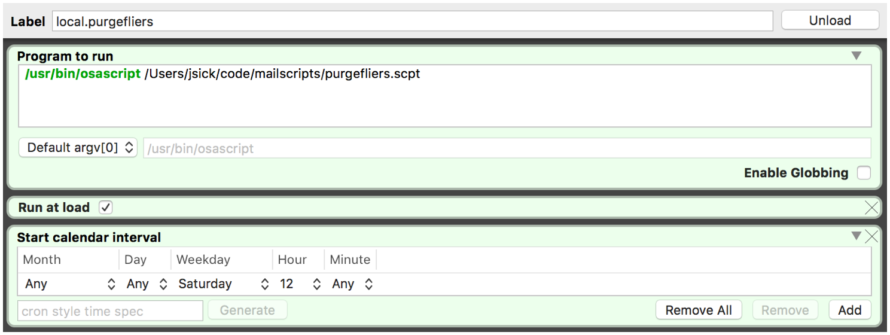

# Mailscript

## Tiny Applescripts to manage my old email

macOS's Mail.app allows you to apply rules to emails as you receive them, but curiously, not after they've been sitting in your inboxes for a while.

Why would you want to act on old email?
Perhaps you've configured [Sanebox](https://www.sanebox.com/signup/d7bf76c883) to sort and send fliers to a `@Fliers` inbox.
Those emails might be useful, but they also have a short shelf-life.
Why manually delete old fliers if a computer can do it for you?

And the Mailscripts project was born.

*Note:* these scripts work for me, but you'll want to fork this project and customize your own scripts based on your own inboxes.

## Scripts

- `purgefliers.scpt` — delete emails in `@Fliers` older than 14 days.

## Launching these scripts

The best way to use these scripts is to have them automatically launch on a regular interval with launchd, which is cron for macOS.

[LaunchControl](http://www.soma-zone.com/LaunchControl/) is a nice app for creating launchd jobs.
Here's an example of a launchd job configured with LaunchControl that runs `purgefliers.scpt` every Saturday at noon.

## Credits

- Purgefliers is based directly upon this StackOverflow answer: http://stackoverflow.com/a/22425494.

## Info

This repo is assembled by Jonathan Sick.
I'm [@jonathansick on Twitter](https://twitter.com/jonathansick); say hello.
